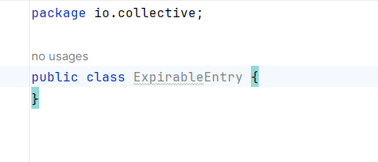

# Ejercicio 2 
Ejercicio: ¡haz pasar las pruebas!

-  Explora usando una clase interna ExpirableEntry
-  Intente no utilizar clases de colección integradas; Listas, mapas o conjuntos.
-  Prueba ejemplos de Java y Kotlin.

Primero crearemos  la clase internaExpirableEntry

## Paso 1: Entender las Pruebas
• El primer paso es entender qué es lo que las pruebas unitarias están verificando. Esto incluye
identificar los métodos que se están probando, los casos de uso que cubren, y los resultados
esperados para cada prueba.

- Como el proyecto esta incompleto nos vamos a guiar de las pruebas unitarias para entender de que trata el proyecto. 
- Comentaremos cada metodo en el codigo de prueba.
- 
